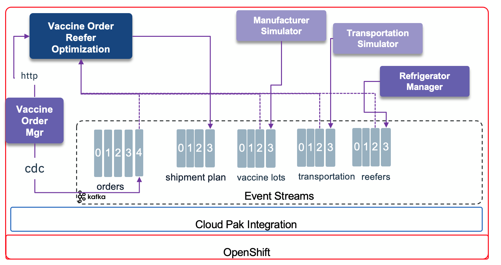

# Vaccine Order & Reefer Optimization

The use case and business problem addressed in this repository is described in [this article](https://ibm-cloud-architecture.github.io/vaccine-solution-main/design/voro/) in the main vaccine solution repository. 

This repository is the implementation of a microservice that exposes API to do the order and refrigerated tank shipping plan optimization. 

It also works as event consumers to get manufacturing data asynchronously from a Kafka Topic.

The following diagram illustrates all the components working together to support and event-driven shipment plan real time optimization:




## Code Explanation

The __init__.py includes the main code to start the Flask server. It defines APIs, starts the different Kafka Consumers:

* ReeferConsumer: for getting information about the refrigerator release and availability
* InventoryConsumer: about vaccine lot inventory
* TransportationConsumer: getting transportation constraints.

The code produces shipment plan to the ``

## Build

This project uses the [Appsody](https://appsody.dev/) python stack. You need Appsody CLI to build and deploy the application to OpenShift.

`appsody build`

## Run locally

`appsody run`

The swagger looks like:


## Deploy to OpenShift

* Connect to the vaccine project using: `oc project vaccine`
* Modify the kubernetes/configmap.yaml with the Kafka Broker URL you are using, and if you changed the topic names too. Then do:

 ```shell
 oc apply -f kubernetes/configmap.yaml
 ```

* Get pem certificate from eventstreams or the Kafka cluster project to the local vaccine project with a command like:

 ```shell
 oc get secret light-es-cluster-cert-pem  -n eventstreams --export -o yaml | oc apply -f - 
 ```
 
 This pem file is mounted to the pod via the secret as:

   ```yaml
   volumeMounts:
  - mountPath: /certs
    name: eventstreams-cert-pem
  volumes:
  - name: eventstreams-cert-pem
    secret:
      secretName: light-es-cluster-cert-pem
  ```

 and the path for the python code to access this pem file is defined in the environment variable: 

 ```yaml
  - name: KAFKA_CERT
    value: /certs/es-cert.pem
 ```

 the name of the file is equal to the name of the {.data.es-cert.pem} field in the secret.
 
 ```yaml
 Name:         eventstreams-cert-pem
 Namespace:    vaccine
 Labels:       <none>
 Annotations:  <none>

 Type:  Opaque

 Data
 ====
 es-cert.pem:  1164 bytes
 ```

* Copy the Kafka user's secret from the e`ventstreams` or Kafka project to the current vaccine project. This secret has two data fields: username and password

 ```shell
 oc get secret eventstreams-cred -n eventstreams --export -o yaml | oc apply -f - 
 ```

They are used in the Deployment configuration as:

 ```yaml
 - name: KAFKA_USER
    valueFrom:
      secretKeyRef:
        key: username
        name: eventstreams-cred
  - name: KAFKA_PASSWORD
    valueFrom:
      secretKeyRef:
        key: password
        name: eventstreams-cred
 ```


