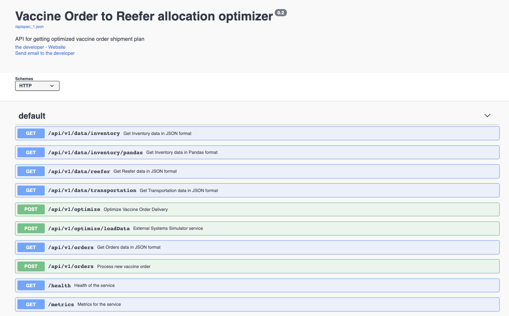

# Vaccine Order & Reefer Optimization

The use case and business problem addressed in this repository is described in [this article](https://ibm-cloud-architecture.github.io/vaccine-solution-main/design/voro/) of the main vaccine solution repository.

This repository is the implementation of a microservice that exposes API to do the order and refrigerated tank shipping plan optimization. This component works as event consumers to get orders, vaccine lots manufactured, and transportation information and as a producer for the shipment plans. The optimization is done with a small model with [Decision Optimization Cplex for python](https://pypi.org/project/docplex/) running in the same process, in production and bigger data model CPLEX needs to run on Cloud Pak for Data. 

The following diagram illustrates all the components working together to support an event-driven shipment plan optimization:


In term of Kafka processing this component illustrates the use of AVRO schema and schema registry.

## Code Explanation

The [app.py](https://github.com/ibm-cloud-architecture/vaccine-order-optimizer/blob/master/app.py) includes the main code to start a Flask server. It defines APIs, starts the different Kafka Consumers:

* ReeferConsumer: for getting information about the refrigerator release and availability
* InventoryConsumer: about vaccine lot inventory
* TransportationConsumer: getting transportation constraints.
* OrderConsumer: get the orders from the order command service.

The code exposes a POST order operation to simplify testing, combined with a POST populate test data for quick demonstration and then produces updated shipment plan to integrate the new order.

The `data/avro` folder includes the different schema definition.

## Build

Simply build the docker image with the command `./script/buildAdd.sh` which does:

```shell
docker build -t ibmcase/vaccine-order-optimizer .
docker push ibmcase/vaccine-order-optimizer
```

The repository includes a [github action workflow](https://github.com/ibm-cloud-architecture/vaccine-order-optimizer/blob/master/.github/workflows/dockerbuild.yaml) to build and push the image automatically to the [public docker registry.](https://hub.docker.com/repository/docker/ibmcase/vaccine-order-optimizer)

The flow uses a set of secrets in the git repo:

* DOCKER_IMAGE_NAME = vaccine-order-optimizer
* DOCKER_REPOSITORY = ibmcase
* DOCKER_USERNAME and DOCKER_PASSWORD

## Run locally

To run the application locally but remote connected to kafka deployed on OpenShift do the following:

* Get the Kafka URL, schema registry URL, the user and password and any pem file containing the server certificate.
* The certificate needs to be under certs folder.
* Copy the script/setenv-tmpl.sh  to script/setenv.sh
* Modify the environment variables.

```shell
source ./script/setenv.sh

docker run -ti -e KAFKA_BROKERS=$KAFKA_BROKERS -e SCHEMA_REGISTRY_URL=$SCHEMA_REGISTRY_URL -e REEFER_TOPIC=$REEFER_TOPIC -e INVENTORY_TOPIC=$INVENTORY_TOPIC -e TRANSPORTATION_TOPIC=$TRANSPORTATION_TOPIC -e KAFKA_USER=$KAFKA_USER -e KAFKA_PASSWORD=$KAFKA_PASSWORD -e KAFKA_CERT=$KAFKA_CERT -p 5000:5000  ibmcase/vaccine-order-optimizer
```

The swagger looks like:



If you want to run this image and be able to continuously update the code, run the docker container with:

```shell
docker run -ti -e KAFKA_BROKERS=$KAFKA_BROKERS -e SCHEMA_REGISTRY_URL=$SCHEMA_REGISTRY_URL -e REEFER_TOPIC=$REEFER_TOPIC -e INVENTORY_TOPIC=$INVENTORY_TOPIC -e TRANSPORTATION_TOPIC=$TRANSPORTATION_TOPIC -e KAFKA_USER=$KAFKA_USER -e KAFKA_PASSWORD=$KAFKA_PASSWORD -e KAFKA_CERT=$KAFKA_CERT -p 5000:5000  -v ${pwd}:/app ibmcase/vaccine-order-optimizer bash
```

## Deploy to OpenShift with Strimzi

The [vaccine-gitops](https://github.com/ibm-cloud-architecture/vaccine-gitops) project includes all the needed Kustomization manifests to deploy Kafka, and the Vaccine Order Optimizer component.

It can be summarized as:

```shell

```

## Deploy to OpenShift with EventStreams as Kafka

TB refresh
* Connect to the vaccine project using: `oc project vaccine`
* Modify the kubernetes/configmap.yaml with the Kafka Broker URL you are using, and if you changed the topic names too. Then do:

 ```shell
 oc apply -f kubernetes/configmap.yaml
 ```

* Get pem certificate from eventstreams or the Kafka cluster project to the local vaccine project with a command like:

 ```shell
 oc get secret light-es-cluster-cert-pem  -n eventstreams --export -o yaml | oc apply -f - 
 ```
 
 This pem file is mounted to the pod via the secret as:

   ```yaml
   volumeMounts:
  - mountPath: /certs
    name: eventstreams-cert-pem
  volumes:
  - name: eventstreams-cert-pem
    secret:
      secretName: light-es-cluster-cert-pem
  ```

 and the path for the python code to access this pem file is defined in the environment variable: 

 ```yaml
  - name: KAFKA_CERT
    value: /app/certs/es-cert.pem
 ```

 the name of the file is equal to the name of the {.data.es-cert.pem} field in the secret.
 
 ```yaml
 Name:         eventstreams-cert-pem
 Namespace:    vaccine
 Labels:       <none>
 Annotations:  <none>

 Type:  Opaque

 Data
 ====
 es-cert.pem:  1164 bytes
 ```

* Copy the Kafka user's secret from the `eventstreams` or Kafka project to the current vaccine project. This secret has two data fields: username and password

 ```shell
 oc get secret eventstreams-cred -n eventstreams --export -o yaml | oc apply -f - 
 ```

They are used in the Deployment configuration as:

 ```yaml
 - name: KAFKA_USER
    valueFrom:
      secretKeyRef:
        key: username
        name: eventstreams-cred
  - name: KAFKA_PASSWORD
    valueFrom:
      secretKeyRef:
        key: password
        name: eventstreams-cred
 ```

* Deploy the application using: `oc apply -f kubernetes/app-deployment.yaml`
* Get the routes to the external exposed URL:

 ```shell
  oc describe routes vaccine-order-optimizer 
 ```
 
* Validate the swagger by accessing the route: `http://vaccine-order-optimizer-vaccine......cloud/apidocs/`
* Trigger the data loading with the operation:
 
 ```shell
 curl -X POST  http://vaccine-order-optimizer-vaccine......cloud/api/v1/optimize/loadData"
 ```

* Send a new order

 ```shell
 curl -X POST -H "Content-Type: application/json" http://vaccine-order-optimizer-vaccine......cloud/    --data "@./data/order1.json"
 ```
